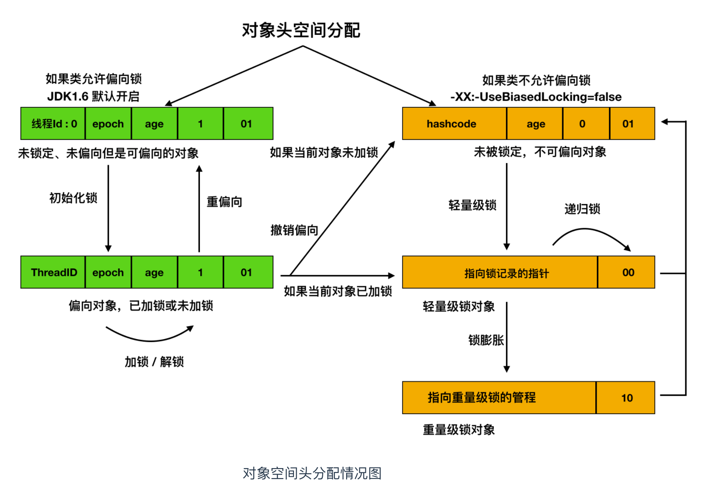

> [不可不说的Java"锁"事](https://tech.meituan.com/2018/11/15/java-lock.html)

按照锁的性质, 可以把锁分组归类

<!-- more -->

## 乐观锁 VS 悲观锁

- 乐观锁: 乐观锁认为自己使用数据时不会有别的线程修改数据, 所以不加锁, 只有再更新的时候去判断有没有别的线程修改了数据
Java中通过CAS算法来实现, 同时, CAS算法也会引出新的问题, 如ABA, 自旋转消耗CPU大

    - 解决ABA的问题的思路是在变量前面添加版本号, JDK1.5后提供了`AtomicStampedReference`类来解决ABA问题

    - Java中的原子操作类都是通过乐观锁实现的
    
    - TODO: 我们来看看原子操作类的源码吧

- 悲观锁: 悲观锁认为自己在使用数据的时候, 一定有别的线程来修改数据, 因此在获取数据前会先加锁, 
确保不会被修改(原来是这么个悲观法), synchronized关键字和`Lock`的实现类都是悲观锁

### 自旋锁 VS 适应性自旋锁

- 什么是自旋: 自旋说的是通过循环来持续占用CPU资源, 不让CPU切换线程, 如果时间过长, 会导致资源白白的浪费

自旋锁也是通过CAS来实现的, 一般可以使用`AtomicReference`来实现一个简单的自旋锁

自旋锁在JDK1.4.2中引入，使用-XX:+UseSpinning来开启。JDK 6中变为默认开启，并且引入了自适应的自旋锁（适应性自旋锁）。

自适应意味着自旋的时间（次数）不再固定，而是由前一次在同一个锁上的自旋时间及锁的拥有者的状态来决定。如果在同一个锁对象上，自旋等待刚刚成功获得过锁，并且持有锁的线程正在运行中，那么虚拟机就会认为这次自旋也是很有可能再次成功，进而它将允许自旋等待持续相对更长的时间。如果对于某个锁，自旋很少成功获得过，那在以后尝试获取这个锁时将可能省略掉自旋过程，直接阻塞线程，避免浪费处理器资源。

### 无锁 VS 偏向锁 VS 轻量级锁 VS 重量级锁(锁升级)

> 查看这节之前, 最好先查看

- 无锁: 不使用锁, 进行更新资源, 所以线程都可以同时对资源进行访问, 但是只有一个线程能够修改成功, 例子: 原子操作类里面使用的CAS算法

- 偏向锁: 线程第一次访问资源的时候, 会设置标志位为01, 设置偏向模式为1, 同时使用`CAS`把获取到锁的线程ID记录在对象的MarkWord中,
后续持有偏向锁的线程每次进入这个锁相关的同步块的时候, 都可以不需要进行同步操作, 所以只有第一次进行了一次同步操作, 减少开销

- 轻量锁: 当锁为偏向锁的时候, 有另外一个线程访问, 则会升级为轻量锁, 
如果对象锁状态为未锁定, 则会在当前线程栈帧中建立锁记录(Lock Record)的, 然后拷贝对象当前的MarkWord到LR中, 如果拷贝成功
则会使用CAS操作尝试将对象的MarkWord更新为指向LR的指针, 然后将LR中的owner指针指向对象的MarkWord

- 重量锁: 进入重量锁后, 所有等待的线程会进入阻塞状态

锁的变化如下:

总结:

无锁, 偏向锁, 轻量锁都使用了CAS算法来实现同步

重量锁 使用了线程阻塞的方式同步

## 公平锁 VS 非公平锁

公平锁: 指的是按照线程申请的顺序来获取锁, 队列中的第一个线程才能获得锁. 优点: 等待锁的线程不会饿死, 缺点: 吞吐效率相对非公平锁要低,
主要原因是: 所有线程都会进入阻塞状态, 因此会有唤醒阻塞线程的开销

非公平锁: 指的是多个线程阻塞前先尝试直接获取锁, 获取不到才会到队列尾进行排队, 如果此时锁刚好可用, 则不会进入阻塞直接获取到锁.
优点: 可以减少唤醒线程的开销, 整体吞吐效率高. 缺点: 队列中的线程可能会饿死, 或者很久才能获取到锁

关于这部分的使用我们通过[ReentrantLock的源码阅读](./ReentrantLock.md)来讲解

## 可重入锁 VS 非可重入锁

可重入锁又名递归锁，是指在同一个线程在外层方法获取锁的时候，再进入该线程的内层方法会自动获取锁（前提锁对象得是同一个对象或者class），不会因为之前已经获取过还没释放而阻塞。Java中ReentrantLock和synchronized都是可重入锁，可重入锁的一个优点是可一定程度避免死锁。

ReentrantLock和synchronized都是重入锁

可重入锁主要是内部维护一个计数器, 当是当前线程再次获取锁的时候, 计算器会执行+1的操作, 直到计算器为0的时候释放锁

不可重入锁内部使用的是一个status状态属性来控制锁状态, 当锁状态为1的时候, 表示已经被占用, 此时不可以获取锁

## 独享锁 VS 共享锁

独享锁也叫排他锁，是指该锁一次只能被一个线程所持有。如果线程T对数据A加上排它锁后，则其他线程不能再对A加任何类型的锁。获得排它锁的线程即能读数据又能修改数据。JDK中的synchronized和JUC中Lock的实现类就是互斥锁。

共享锁是指该锁可被多个线程所持有。如果线程T对数据A加上共享锁后，则其他线程只能对A再加共享锁，不能加排它锁。获得共享锁的线程只能读数据，不能修改数据。

独享锁与共享锁也是通过AQS来实现的，通过实现不同的方法，来实现独享或者共享。