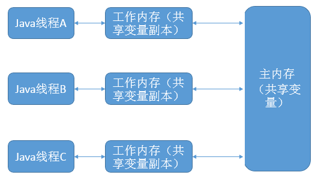
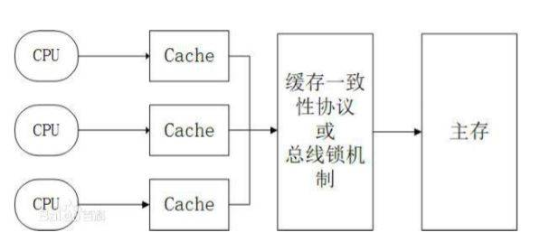

# volatile

> https://juejin.im/post/6844903959107207175

volatile关键字只能修饰类变量和实例变量。方法参数、局部变量、实例常量以及类常量都是不能用volatile关键字进行修饰的.

就算是被volatile修饰的关键字, 也需要经历写入缓存, 缓存再写入主存的步骤, 并不会直接写入主存

<!-- more -->
 
修饰以后主要的作用有:

- 保证不同线程之间的数据可见性

    根据java的内存模型, 内存被划分为了`主内存`和`线程内存`, 线程内存中存放的是变量副本, 因此在并发修改变量的时候, 因为修改的是内存副本中的变量,
    修改的值不能及时刷新到主内存中, 同样别的内存读到的也可能是旧数据, 因此并发操作可能会导致和预期结果不一致
    
- 禁止重排序
    
    禁止被volatile变量的后面的指令放到之前去执行, 查看汇编代码会发现, volatile变量的位置会加上了一个`lock`的标志,这个作用相当于内存屏蔽,
    相当于说, 未执行完前面的步骤, 无法穿过这道屏障
    
    
由于volatile变量只能保证可见性, 在不符合以下两条规则的运算场景下, 我们仍然要通过加锁来保证原子性:

- *运算结果并不依赖变量的当前值, 或者能够确保只有单一的线程修改变量的值*

- *变量不需要其他的状态变量共同参与不变约束*
    
## java内存模型

Java内存模型(Java Memory Model)是为了屏蔽各种不同硬件和操作系统的内存访问差异提出的, 为了实现Java程序在各种平台下都能达到一致的访问目的的抽象

## 硬件层面

由于CPU的数量增多, 为了让CPU处理更多任务, 提出了并行, 但是因为CPU计算速度和内存读取速度差了几个量级, 为了解决这个问题, 引入了
接近CPU计算速度的高速缓存, 这样CPU计算就不需要等待内存读写, 但是也出现了缓存数据的一致性问题

除了缓存之外, 为了提供运行效率, CPU会对输入的代码进行重排序(Out-Of-Order Execution)的优化

### MESI协议

MESI表示了缓存行的四种状态:

- M(Modify) 表示共享数据只缓存当前CPU缓存中，并且是被修改状态，也就是缓存的数据和主内存中的数据不一致。

- E(Exclusive) 表示线程的独占状态，数据只缓存在当前的CPU缓存中，并且没有被修改

- S(Shared) 表示数据可能被多个CPU 缓存，并且各个缓存中的数据和主内存数据一致

- I(Invalid) 表示缓存已经失效