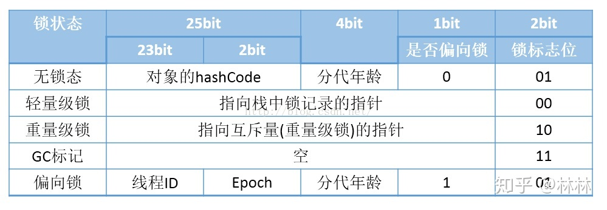
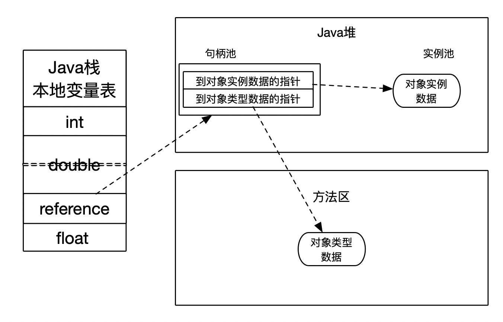
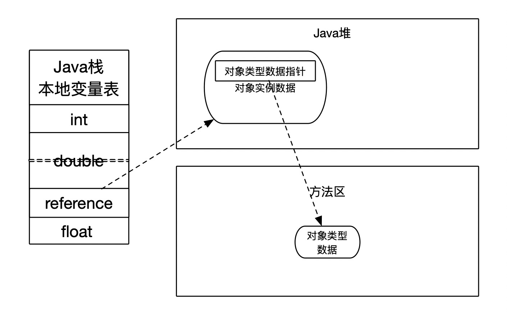

> 我们以HotSpot虚拟机来说明
>
> 参考深入理解Java虚拟机(第三版)
>
> 参考[聊聊java对象内存布局](https://zhuanlan.zhihu.com/p/50984945)

对象存放在堆内存中, 在堆内存中的存储布局可以划分为3个部分:

- 对象头: 用于存放对象自身运行时的数据(MarkWord), 存放类型指针,用于确定是那个类的实例, 如果是数据组, 则还包含一个块用于记录数组长度的数据 

- 实例数据: 实例数据存放的就是我们在类中定义的各种字段, 或者父类中存放的字段

- 对齐填充: 由于虚拟机的自动内存管理需要对齐的起始地址为8字节的整数倍, 因此如果对象大小不是8字节的整数倍则该部分来填充占位

<!-- more -->

## 对象头

### MarkWord

该部分主要存储对象自身的运行时数据, 如`HashCode`, `GC分代年龄`, `锁状态标志`, `线程吃鱿鱼的锁`, `偏向线程ID`, `偏向时间戳`等

这部分数据长度在32bit或者64bit, 分别对应着32位的jvm和64位的jvm(未开启压缩指针)

如图所示, 因为复用了这部分的可见, 所以MarkWord的内容是根据锁标志位来区分当前MarkWord的内容

### 对象指针

Java虚拟机通过这个指针来确定该对象是哪个类的实例, 并不是所有的虚拟机实现都必须在对象数据上保留类型指针,
也就是说查询对象的元数据信息并不一定要经过对象本身

### 数组长度

如果对象是一个Java数组, 你们在对象头中海必须有一块用于记录数组长度的数据, 因为虚拟机可以通过普通的Java对象的元数据信息
确定Java对象的大小, 但是如果数据的长度不确定, 将无法通过元数据中的信息推断出数组大小

## 实例数据

实例字段的存储分配策略, 在HotSpot虚拟机默认的分配顺序为 `longs/doubles`, `ints`, `shorts/chars`, `bytes/booleans`,
`oops(Ordinary Object Pointers)`

由此可以看出默认分配策略中, 相同宽度的字段总是被分配到一起, 再次前提下

父类的变量会出现在子类之前

## 对象的访问定位

在<<Java虚拟机规范>>中指明, reference类型是一个指向对象的引用, 但是并没有定义应该通过什么方式去定位,访问到堆中对象的具体位置,
所以对象访问的方式也是虚拟机实现而定的, 目前主流的有两种:

- 句柄:  Java堆中将可能会划分出一块内存作为句柄池, reference存储的就是对象的句柄地址, 句柄中包含了`对象实例数据`和`类型数据`的地址信息

- 直接指针:  reference存储的是对象的地址, 对象的实例数据中还会存储类型数据的指针, 因此如果只是访问实例数据, 就不需要多一次访问的开销

HotSpot虚拟机使用的是直接指针访问的方式